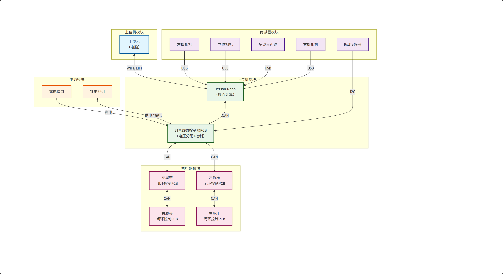

# 电子设计 (Electronics)

## 概述

水下清洁机器人的电子系统负责机器人的控制、感知、通信和动力管理。系统采用模块化设计，确保各部分功能独立且易于维护和升级。

## 主要电子元件和传感器

### 核心处理器
- **Jetson Nano**：负责高级计算任务，如SLAM算法、路径规划和决策控制
- **STM32**：负责实时控制任务，如电机驱动、传感器数据采集和底层通信

### 传感器
- 摄像头：用于环境感知和SLAM定位
- 压力传感器：用于测量水深
- 距离传感器：用于避障和导航
- 姿态传感器：用于测量机器人的姿态和运动
- 水流传感器：用于感知水流速度和方向

### 执行器
- 电机：用于驱动机器人的移动和清洁刷
- 水泵：用于产生负压吸附力
- 电磁阀：用于控制水流和气压

## 电气架构

电气架构图已在`imgs/电气架构图.png`中提供，系统采用分层设计：



1. **感知层**：包含各种传感器，负责环境信息的采集
2. **控制层**：包含Jetson Nano和STM32，负责数据处理和决策控制
3. **执行层**：包含电机、水泵等执行器，负责执行控制命令
4. **通信层**：负责机器人内部和外部的通信
5. **电源层**：负责系统的供电和能源管理

*注：电气架构的详细设计正在进行中。*

## 通信系统设计

通信系统是水下清洁机器人的重要组成部分，负责机器人与水面控制站之间的数据传输和命令接收。目前团队正在讨论两种通信方案：

1. **方案1**：水下缆线通信 + 水面无线通信
2. **方案2**：水下LiFi通信 + 水面无线通信

具体的通信系统设计将在后续确定。

## 固件设计

### 功能
- 电机控制：实现机器人的移动和清洁刷的控制
- 传感器数据采集和处理：采集各种传感器数据并进行预处理
- 通信协议实现：实现机器人内部和外部的通信协议
- 故障检测和保护：检测系统故障并采取保护措施

### 实现
- 主要开发语言：C/C++
- 开发环境：Atmel Studio（基于VS）
- 负责人：王盛先、陶军

## 目录结构

```
Electronics/
├── Firmware/         # 固件代码
│   └── .vs/          # VS项目配置
├── imgs/             # 电气架构图
│   └── 电气架构图.png
└── readme.md         # 电子设计文档
```

## 未来计划

1. 完成电气架构的详细设计
2. 实现STM32固件的开发
3. 完成通信系统的设计和测试
4. 进行系统集成和测试
5. 优化系统性能和可靠性