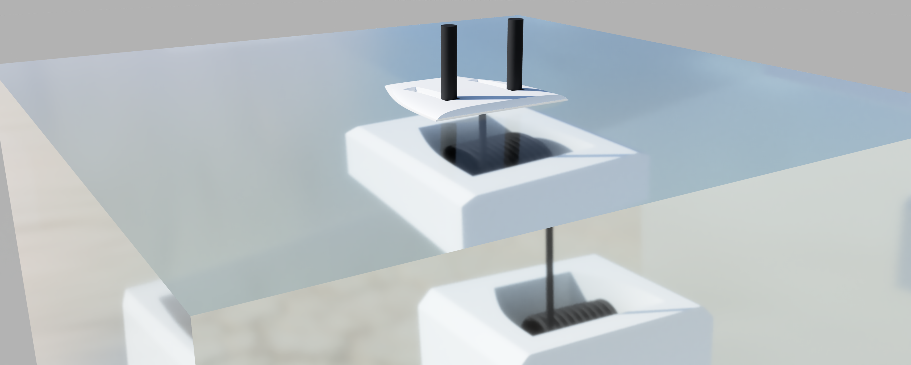

# 机械设计 (Mechanical)

## 概述

水下清洁机器人的机械系统是机器人实现运动、吸附和清洁功能的基础。系统采用模块化设计，确保各部分功能独立且易于维护和升级。

## 整体结构与设计特点

### 核心设计理念
机器人采用**负压吸附技术**，通过水泵产生的负压将机器人紧密吸附在轮船船体表面，确保在各种水下环境和船体角度下的稳定附着。

### 整体结构
机器人主要由以下几个部分组成：

1. **主体框架**：支撑整个机器人的结构，采用轻量化设计
2. **吸附系统**：包含水泵和吸附腔，用于产生负压吸附力
3. **移动系统**：包含电机和履带/轮系，用于驱动机器人在船体表面移动
4. **清洁系统**：包含清洁刷和高压水枪，用于清洁船体表面
5. **电子舱**：用于放置电子设备，确保防水密封
6. **通信系统**：用于机器人与水面控制站之间的通信

## 主要组件和材料

### 结构材料
- **3D打印结构件**：用于非承重和复杂形状的部件，采用高强度塑料材料
- **铝合金件**：用于承重部件，如主体框架和传动系统
- **不锈钢件**：用于水下环境中的耐腐蚀部件
- **密封材料**：用于电子舱和其他需要防水密封的部件

### 核心组件
- **水泵**：用于产生负压吸附力
- **电机**：用于驱动机器人的移动和清洁刷
- **清洁刷**：用于清洁船体表面
- **履带/轮系**：用于机器人在船体表面的移动
- **密封舱**：用于保护电子设备免受水的侵害

## 通信方案设计

机器人设计了两种通信方案，以适应不同的应用场景：

### 通信方案1
- **通信方式**：水下缆线通信 + 水面无线通信
- **特点**：通信稳定可靠，不受水下环境影响，但缆线会限制机器人的活动范围
- **渲染图**：



其他渲染图：`imgs/通信方案1渲染图2.png`至`imgs/通信方案1渲染图4.png`

### 通信方案2
- **通信方式**：水下LiFi通信 + 水面无线通信
- **特点**：机器人活动范围不受限制，但LiFi通信在复杂水下环境中可能受到影响
- **渲染图**：


其他渲染图：`imgs/通信方案2渲染图2.png`

### 选择依据
通信方案的选择将根据具体的应用场景和需求来决定：
- 对于小范围、高精度的清洁任务，优先选择通信方案1
- 对于大范围、灵活性要求高的清洁任务，优先选择通信方案2

## CAD模型

- **模型文件**：`CAD/水下环境.step`
- **状态**：正在设计中
- **软件**：SolidWorks

*注：CAD模型的详细设计正在进行中。*

## 目录结构

```
Mechanical/
├── CAD/                  # CAD模型
│   └── 水下环境.step
├── imgs/                 # 渲染图和图片
│   ├── 通信方案1渲染图1.png
│   ├── 通信方案1渲染图2.png
│   ├── 通信方案1渲染图3.png
│   ├── 通信方案1渲染图4.png
│   ├── 通信方案2渲染图1.png
│   └── 通信方案2渲染图2.png
└── readme.md             # 机械设计文档
```

## 未来计划

1. 完成CAD模型的详细设计
2. 制作原型机进行测试
3. 优化机械结构，提高机器人的性能和可靠性
4. 进行水下环境测试，验证设计的有效性
5. 根据测试结果进行改进和优化