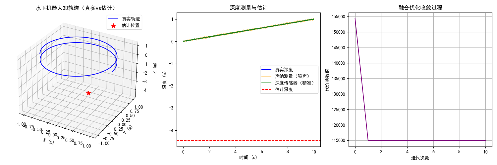

# 软件设计 (Software)

## 概述

水下清洁机器人的软件系统负责机器人的自主导航、定位、路径规划和清洁控制。系统采用模块化设计，确保各部分功能独立且易于维护和升级。

## 水下SLAM算法

### 算法选择
经过对多种水下SLAM算法的比较和分析，项目最终选择了**SVIn2**算法作为机器人的自主定位解决方案。

### 算法特点
- 适用于水下环境的视觉惯性导航系统
- 具有较高的定位精度和稳定性
- 能够处理水下环境中的光照变化和图像模糊问题
- 计算效率高，适合在嵌入式平台上运行

### 参考资料
在`水下SLAM/`目录中提供了多种SLAM算法的参考资料，包括：
- LSD-SLAM
- DSO
- ORB-SLAM2/3
- OKVIS2
- MSCKF
- DeepVIO
- SelfVIO
- AEKF-SLAM

这些资料为算法的选择和改进提供了重要的参考依据。

## SVIn2软件

### 功能
SVIn2（Stereo Visual-Inertial Navigation）是一种基于视觉和惯性传感器的导航系统，主要功能包括：
- 实时定位：通过视觉和惯性数据融合，实现机器人的实时定位
- 地图构建：构建周围环境的三维地图
- 路径规划：根据地图信息规划清洁路径
- 避障功能：通过环境感知实现障碍物的检测和躲避

### 实现
- **主要文件**：`SVIn2/SVIn2.py`
- **编程语言**：Python
- **依赖库**：OpenCV、NumPy、SciPy等
- **算法细节**：详细实现见代码注释

### 使用方法
使用SVIn2软件的详细步骤和参数设置见代码文件中的注释说明。

### 模拟结果
软件的模拟结果已在`SVIn2/simulation_result.png`中提供，展示了算法的定位精度和稳定性：



## 其他软件组件

*注：其他软件组件的设计正在构思中。*未来将包括：

1. **控制系统**：负责机器人的运动控制和清洁刷控制
2. **通信系统**：负责机器人与水面控制站之间的通信
3. **用户界面**：提供直观的用户操作界面
4. **数据管理系统**：负责数据的存储、分析和可视化

## 目录结构

```
Software/
├── SVIn2/            # SVIn2算法实现
│   ├── SVIn2.py      # 主程序文件
│   └── simulation_result.png  # 模拟结果
├── 水下SLAM/         # SLAM算法参考资料
│   ├── 1_LSD-SLAM.pdf
│   ├── 2_DSO.pdf
│   ├── 4_ORB-SLAM2.pdf
│   ├── 5_ORB-SLAM3.pdf
│   ├── 8_OKVIS2.pdf
│   ├── 9_SVIn2.pdf
│   ├── 10_VINS-Mono.pdf
│   ├── 11_MSCKF.pdf
│   ├── 12_DeepVIO.pdf
│   ├── 13_SelfVIO.pdf
│   └── 15AEKF-SLAM.pdf
└── readme.md         # 软件设计文档
```

## 未来计划

1. 完成SVIn2算法的优化和改进
2. 开发控制系统和通信系统
3. 实现用户界面和数据管理系统
4. 进行软件系统的集成和测试
5. 优化软件性能，提高实时性和稳定性

## 开发环境

- **操作系统**：Linux/Ubuntu
- **开发工具**：Python、C++、OpenCV
- **硬件平台**：Jetson Nano

## 测试与验证

软件系统的测试和验证将分为以下几个阶段：
1. **单元测试**：对各个模块进行独立测试
2. **集成测试**：对整个软件系统进行集成测试
3. **仿真测试**：在仿真环境中测试软件性能
4. **实际环境测试**：在实际水下环境中测试软件性能